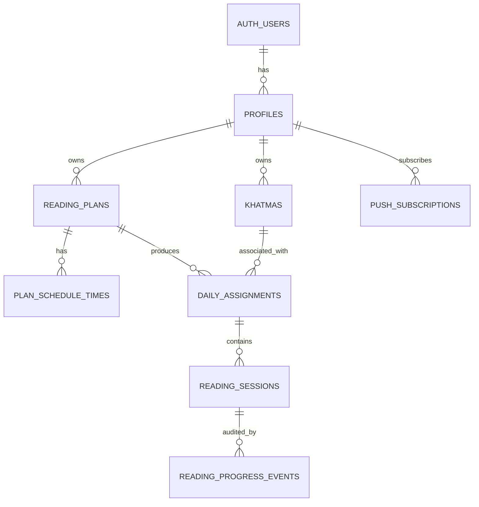

# Database Schema — Wird (Supabase/Postgres)

## Purpose

This document describes the initial Supabase PostgreSQL schema created for Wird (Task 1A). It documents tables, relationships, constraints, RLS policies, and important implementation notes.

## Schema principles

- Server-authoritative data with Row Level Security (RLS) on all application tables.
- Enforce critical business rules at the database level (page bounds, single active plan, page-range overlap protection, append-only progress events).
- Preserve historical records (khatmas, progress events).
- Keep ownership consistency via composite foreign keys where appropriate.

## Main tables

- `auth.users` (managed by Supabase auth)
- `public.profiles` — user profiles (id references `auth.users(id)`)
- `public.reading_plans` — one active plan per user enforced via partial unique index
- `public.plan_schedule_times` — scheduled session times per plan
- `public.khatmas` — khatma cycles (history preserved)
- `public.daily_assignments` — assignments per local date
- `public.reading_sessions` — session records with inclusive page ranges
- `public.reading_progress_events` — append-only completion audit
- `public.push_subscriptions` — future push subscription storage

## Important columns and relationships

- `profiles.id` (uuid) references `auth.users(id)`; created by trigger when a new auth user is inserted.
- `reading_plans.user_id` references `profiles(id)`; partial unique index enforces one active plan per user.
- `daily_assignments` are unique on `(reading_plan_id, local_date)`.
- `reading_sessions` reference `(daily_assignment_id, user_id)` to ensure ownership consistency; session order is unique per assignment.
- `reading_progress_events` are append-only and unique per `reading_session_id` to avoid duplicate completions.

## Persisted states vs derived UI states

Persisted session status enum: `pending`, `in_progress`, `completed`.

The UI may present `upcoming`, `available`, or `missed` derived from persisted status, scheduled time, current time, local date, and user timezone. These presentation states are NOT stored in the database.

## Quran page boundaries

- Pages are integers 1 through 604 inclusive. All page-related columns (`start_page`, `end_page`, `current_unread_page`, `target_pages`) are constrained to this range.

## Timestamp and timezone strategy

- Timestamps are stored as `timestamptz` (UTC-compatible). Presentation uses the user's saved `timezone` field.
- `profiles.timezone` defaults to `Africa/Cairo`.

## One-active-plan and one-active-khatma rules

- Enforced via partial unique indexes on `reading_plans` (status = 'active') and `khatmas` (status = 'active').
- Atomic plan creation uses a trusted RPC with `SECURITY DEFINER` so the client may create related rows without broad insert policies on every table.
- Ownership is derived from `auth.uid()` inside the function, not from any client-supplied `user_id`.
- A transaction-scoped advisory lock is used per user to serialize concurrent plan creation and avoid duplicate active plans or duplicate khatma cycle numbers.

## Session page-range overlap protection

- Implemented via a BEFORE INSERT OR UPDATE trigger `check_session_page_overlap` which rejects overlapping inclusive page ranges within the same `daily_assignment`.

## Append-only progress events

- `reading_progress_events` stores explicit user-confirmed completions; only one event per `reading_session_id` is allowed. The table is append-only by convention; no update or delete policies are granted to client roles.

## Ownership model and integrity

- Child tables that include both `user_id` and a parent id use composite foreign keys (e.g., `(daily_assignment_id, user_id)`) referencing a composite unique key on the parent to ensure ownership consistency.

## RLS model (high level)

- Every application table has RLS enabled.
- Policies allow authenticated users to select their own rows; insert/update/delete policies are restrictive and scoped to ownership where appropriate.
- Progress events and many write operations are intended to be performed by trusted server operations (functions) rather than broad client policies.

## Data deletion behaviour

- Deleting a `profile` cascades to most application data for that user (plans, assignments, sessions, progress events, subscriptions).
- Deleting a `reading_plan` DOES NOT delete khatma history; `khatmas.reading_plan_id` is `ON DELETE SET NULL`.

## Deferred operations

- Atomic session-completion operation is intentionally deferred to a later task; it will record progress events and update related state atomically.

## Local development commands

- Start Supabase local stack: `npm run db:start`
- Reset local DB: `npm run db:reset`
- Run DB tests: `npm run db:test`
- Generate TypeScript types (when local stack is available): `npm run db:types`

## Known limitations

- Some policies expect Supabase's `auth.uid()` function and the `auth.users` table; local test environments must provide these.
- Tests are written to assume pgTAP availability; adjust test runner setup as needed for local CI.

## ER Diagram

